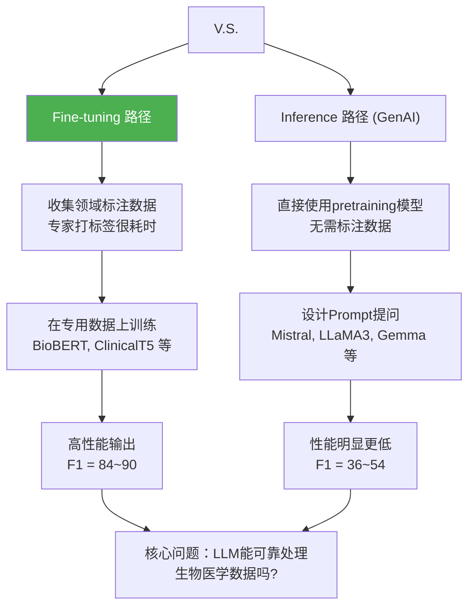

## 2026-04-21

1. ClaudePro输出实验三阶段计划书
2. codex开始执行
3. 下载了geometric包和PubMedBert-base
4. somehow明天可以直接在5090跑了，谢谢

## 2026-04-22

1. 把实验室机子的项目删了，用git的方式clone下来
2. 上传数据文件和模型，配环境
3. OOM了，干脆等他们跑完算了
4. OOM问题自行解决，但没开screen会话
5. 最终回学校开screen再跑了一次

## 2026-04-23

1. 昨晚跑的screen，又OOM
2. 看了一下memory感觉能跑，于是继续
3. 这次的epoch2是88.几，我记得昨天达到了89.几
4. 跑到epoch4的时候，胡嘉欣希望他先跑完

## 2026-04-29

1. 把实验搬迁到host4上跑
   
## 2026-04-30

1. 跑到晚上十点才跑完，整整超过24h
2. 先前的epoch设置为20，且只记录最后一轮epoch的结果，显然不对，所以做了修改并重新跑。
3. 由于跑的是独立的，所以分别在host2和host4上跑

## 2026-05-01

1. 一晚上居然两个机子上都跑完了，看来是没人用的原因，之前那么慢是因为别人也在用吧。
2. 继续跑第三第四个
3. 看论文写周报

## 2026-05-02

1. 在酒店查看实验，发现第三第四个都跑完了
2. 于是继续跑第五第六个

## 2026-05-04

1. 都跑完了，把阶段二checkpoints穿回本地，还挺久的

## 2026-05-06

1. 叫codex编写结果文件，以及下一步GB-IM模块的代码编写
2. 可以去实验室机子跑，也就是加上GB-IM信息压缩模块后的实验，只用跑两个文件

## 2026-05-09

1. 加入GB-IM模块之后的实验也跑完了，不过一开始进入是一直卡在epoch16，询问了Gemini相关原因，最终他自己解决了，估计是终端字符流传输原因。

## 2026-05-13

1. 加入那个GB-IM模块之后，chemprotsent数据集正确数量少了两个，CDR多了三个，所以可以看到这个模块几乎没起作用。
2. 审查发现是两个的best_epoch都出现了eval_compression_ratio = 0.0
3. 这意味着固定阈值 selection_threshold=0.475 把边全筛掉了，所以现在试试不同的threshold。
4. 现存都满了，算了，明天看看
5. 看论文，结果看到一篇论文，结论就是微调比通用大模型好，我就知道当时这篇论文下面的生物学3区的不是什么好预兆。。。

不过学会了mermaid的语法：

## 2026-05-14

1. host4的1号空闲，开始跑！
2. 开了两个会话，一起跑，谢谢，因为1号剩余42g显存谢谢。

## 2025-05-15

1. cdr跑完了chem才到第二轮，一看发现是只分配了2.6g显存，谢非凡的实验一个人占了48g，谢谢。
2. 其实大概看了一下估计有问题，anyway i could care less，还是等他跑完吧。

## 2025-05-16

1. 手写论文笔记太爽了

## 2025-05-18

1. 文件传回来，确实有问题，换了另一种方法，核心改动是让 z_ij 不再只是影响最终池化权重。本地验证说可以，正在实验室机子跑，并产出记录文档。
2. 撰写中期报告。

## 2025-05-19

1. 撰写中期报告
2. 学习论文

## 2025-05-23

1. codex也说放弃信息压缩模块，主攻双视角模块
2. 补了一个b7视角，写了代码
3. 开始在5090跑

## 2025-05-24

1. b7已经跑完，效果蛮不错，所以继续全量开始跑