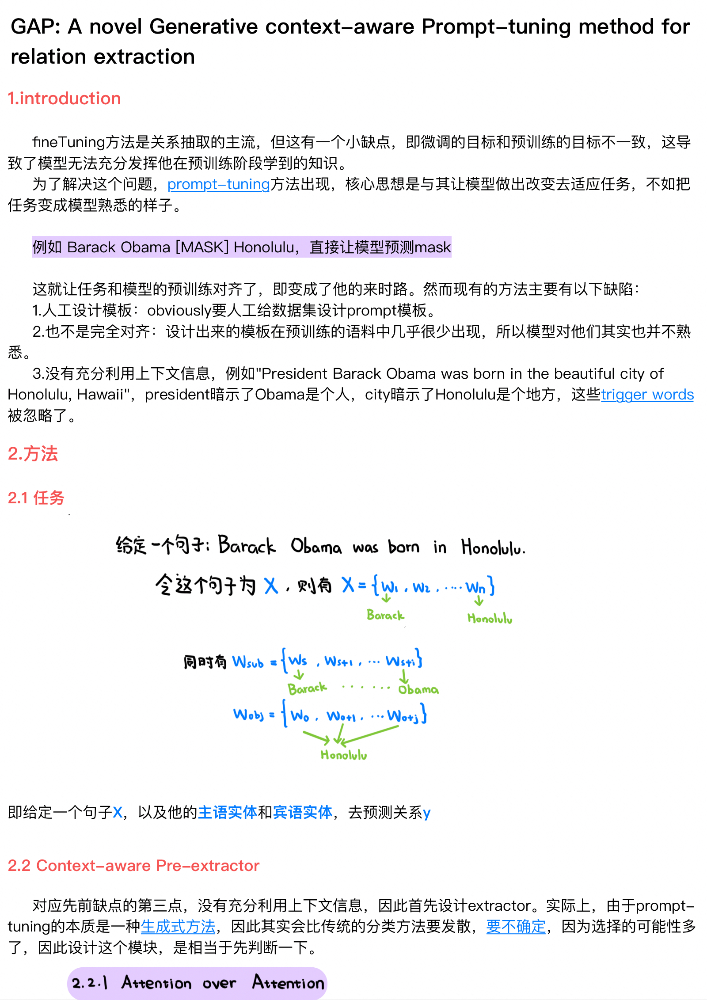
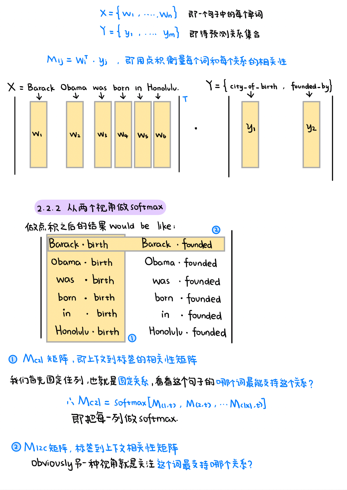
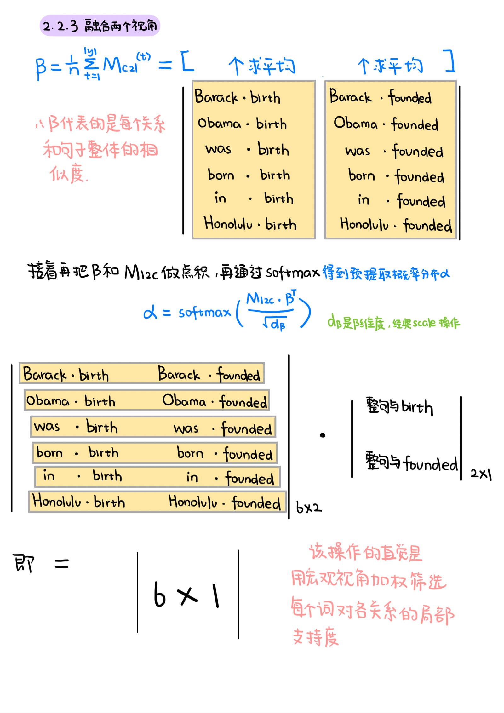
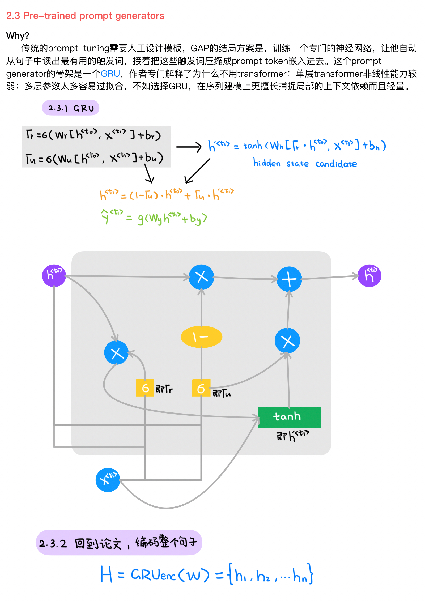
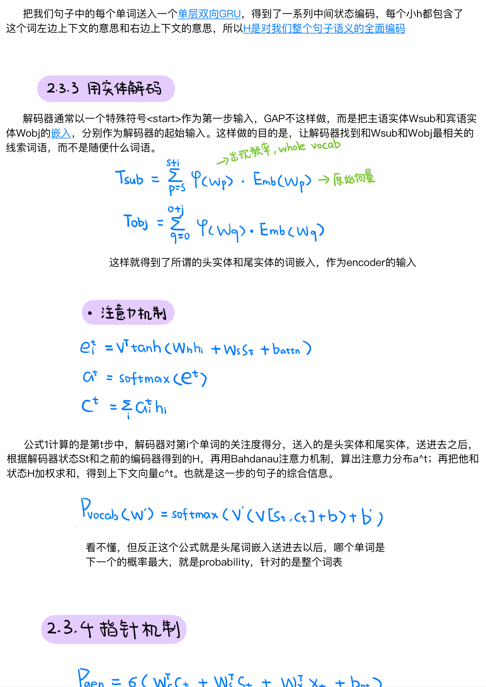
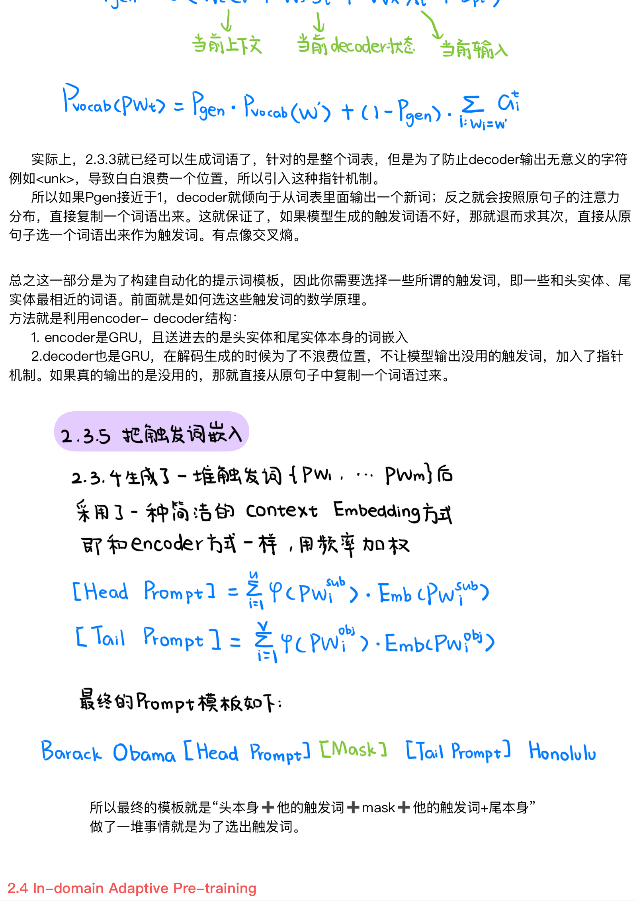
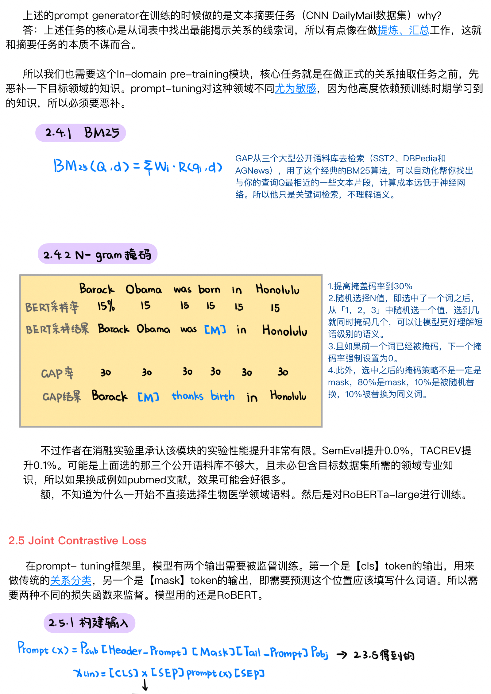
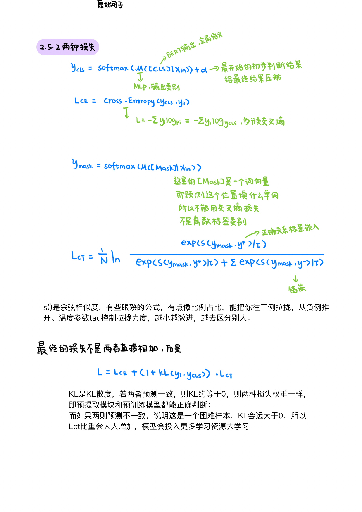

# 20260506-20260520

## 论文

## 实验

| 数据集       |                模型 | best epoch | mapped exact | eval loss |
| ------------ | ------------------: | ---------: | -----------: | --------: |
| ChemProtSent |   B4 semantics-only |          9 |     0.901083 |  0.084065 |
| ChemProtSent | B5 dual-view concat |         17 |     0.896106 |  0.083922 |
| ChemProtSent |                  v1 |         14 |     0.895932 |  0.098628 | 
| CDRIntra     | B5 dual-view concat |         14 |     0.775451 |  0.251782 |
| CDRIntra     |                  v1 |         10 |     0.776028 |  0.238254 |

&emsp;&emsp;加入信息筛选模块性能几乎没有提升，正在改善参数重新跑。
